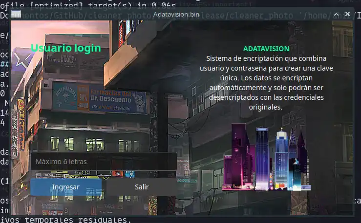
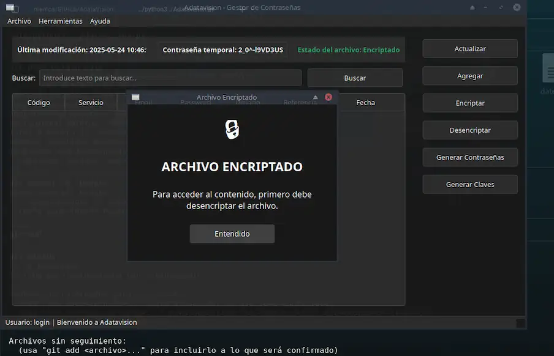

<div align="center"></div>

AdataVision es un gestor de contraseñas con interfaz gráfica que almacena y protege tus credenciales usando cifrado Fernet seguro. Las claves de cifrado se generan automáticamente a partir del usuario y contraseña, sin guardarlas en disco.

## Capturas de Pantalla

<div align="center"></div>
<div align="center"></div>


## Características Principales

- **Sistema de autenticación** con usuario personal
- **Cifrado Fernet** para protección de datos
- **Generador integrado** de contraseñas seguras
- **Búsqueda avanzada** con filtrado rápido
- **Copia al portapapeles** para acceso rápido
- **Auto-encriptación** al cerrar la aplicación

## Instalación O ejecucion
 - clona el repo y instala las dependencias
 ```bash
pip install -r requirements.txt
```
### Ejecuta
```bash
python3 Adatavision.py
```
 - o ejecuta el Adatavision.bin(Asegurate de darle permisos de ejcucion con chmod +x ./Adatavision.bin)

## Requisitos del Sistema
- Python 3.8 o superior
- PySide6 >= 6.5.0
- cryptography >= 41.0.0

## Ayudama a mejorarla
- pull request bienvenidos

## Licencia


MIT License
