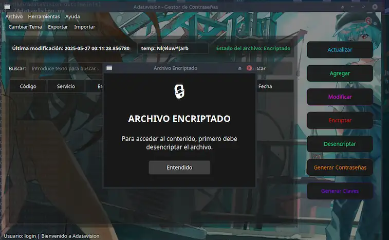

# AdataVision - Gestor Seguro de Contraseñas

AdataVision es un gestor de contraseñas con interfaz gráfica moderna que permite almacenar y gestionar credenciales de forma segura utilizando cifrado Fernet (AES-128 en modo CBC).

## Capturas de Pantalla




## Características Principales

- **Sistema de autenticación** con usuario personal
- **Cifrado Fernet** para protección de datos
- **Gestión completa** de credenciales almacenadas
- **Generador integrado** de contraseñas seguras
- **Búsqueda avanzada** con filtrado rápido
- **Copia al portapapeles** para acceso rápido
- **Auto-encriptación** al cerrar la aplicación

## Instalación

### Clonar el repositorio
```bash
git clone https://github.com/jahirWH/AdataVision.git
cd AdataVision
```

### Instalar dependencias
```bash
pip install -r requirements.txt
```

### Ejecutar la aplicación
```bash
python3 Adatavision.py
```

## Requisitos del Sistema

- Python 3.8 o superior
- PySide6 >= 6.5.0
- cryptography >= 41.0.0

## Seguridad

- Los datos se almacenan en formato CSV encriptado
- El archivo se cifra automáticamente al cerrar la aplicación
- Se requiere autenticación del usuario original para desencriptar
- Utiliza algoritmo de cifrado Fernet para máxima seguridad

## Licencia

MIT License
